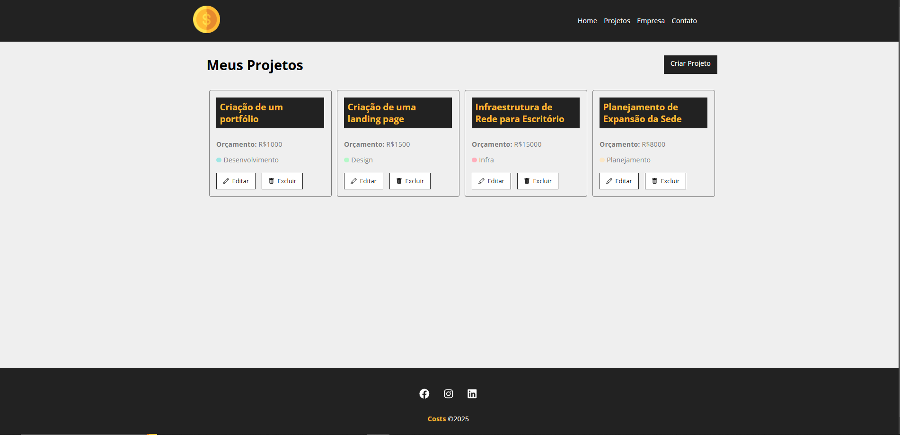
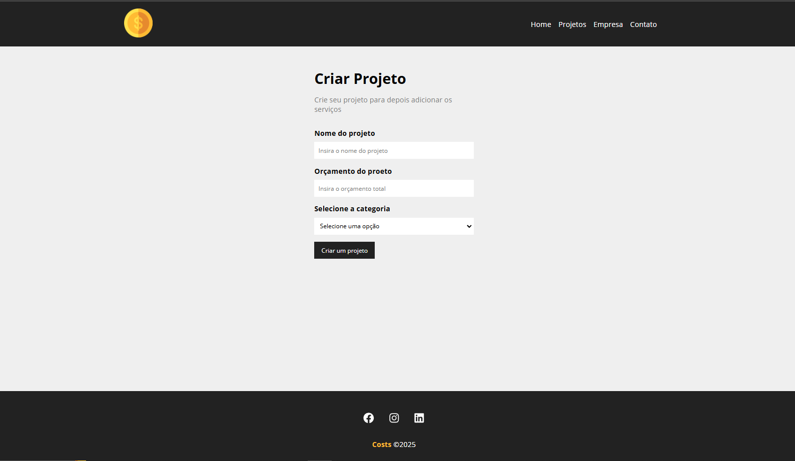
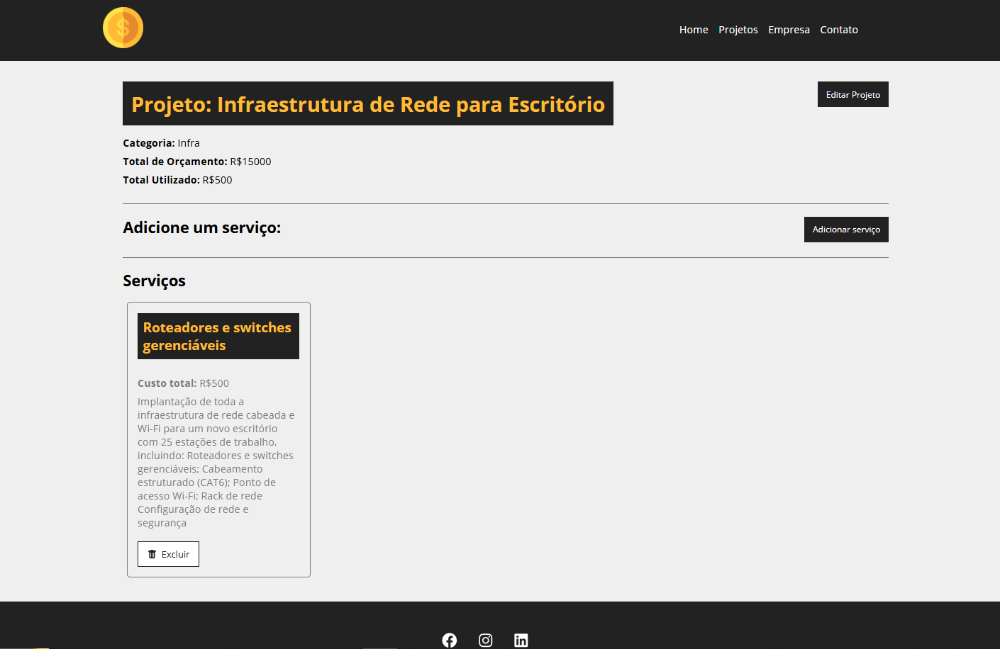

# 💰 COSTs - Gerenciador de Projetos e Orçamentos

Projeto desenvolvido com o objetivo de praticar e consolidar conhecimentos em React, organização de componentes, gerenciamento de estado, rotas, props e criação de interfaces reutilizáveis.

---

## 📌 Sobre o Projeto

O **COSTs** é um sistema simples de **gestão de projetos com controle de orçamento**. Com ele, é possível:

- Criar projetos com título, categoria e orçamento.
- Adicionar e remover serviços associados aos projetos.
- Acompanhar o progresso do orçamento conforme os serviços são adicionados.
- Gerenciar os dados de forma dinâmica com feedback visual para o usuário.

---

## 🛠 Tecnologias Utilizadas

- ⚛️ **React.js**
- 📍 **React Router DOM**
- 🎨 **CSS Modules**
- 📦 **JSON Server** (simulação de API REST)
- 📁 **JavaScript (ES6+)**
- ⚡ **Vite** (estruturação e build do projeto)

---

## 🔗 Deploy

Você pode acessar a versão online do projeto clicando no link abaixo:  
👉 [https://costs.vercel.app]([https://costs.vercel.app](https://costs-delta-nine.vercel.app/projects))

⚠️ **Observação**: O backend (JSON Server) foi utilizado localmente apenas para fins de simulação. Por isso, no deploy, os dados dinâmicos não estão sendo carregados.  
No entanto, o funcionamento completo pode ser visualizado pelas imagens abaixo ou ao rodar localmente.

---

## 📷 Demonstrações

### 🏠 Tela Inicial


### 📋 Listagem de Projetos


### ➕ Cadastro de Projetos


### 🛠 Serviços Adicionados


---

## 🚀 Como Executar Localmente

1. **Clone o repositório:**
```bash
git clone https://github.com/seuusuario/costs.git
